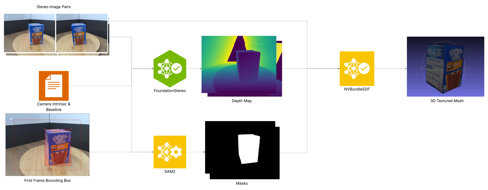

# NVIDIA 3D Object Reconstruction Framework

## 🆕 Updates & News
- June, 2026: We release Commercial Version Of 3D Object Reconstruction Pipeline!
  1. We use [Theseus](https://github.com/facebookresearch/theseus) optimizers for pose optimization to replace [BundleFusion](https://github.com/niessner/BundleFusion).
  2. Add optional config for color fusion across views to handle varying lighting conditions.
  (See [Configuration](#configuration) for usage)
  3. We now use commercial version [FoundationStereo ONNX weight](https://catalog.ngc.nvidia.com/orgs/nvidia/teams/tao/models/foundationstereo/) from NVIDIA TAO Toolkit. Now could be enabled through FoundationStereo [configuration](#configuration).
  4. Add multi-architecture Docker support with automatic detection: deployment now automatically detects x86_64 vs ARM64 (tested on Jetson Orin) and uses the appropriate Dockerfile (`Dockerfile` or `Dockerfile.aarch64`) and upgrade to pytorch 2.7.0 for better compatiblity especially for newer architechures.
  5. Add USD Exporting, Now we will export USD and USDZ of the reconstructed object for further usage.


## Framework Overview

Deploy this example to create a **3D object reconstruction workflow** that transforms stereo video input into high-quality 3D assets using state-of-the-art computer vision and neural rendering techniques.

NVIDIA's 3D Object Reconstruction framework represents a significant advancement in automated 3D asset creation. Real-world tests have demonstrated the ability to **generate production-ready 3D meshes with photorealistic textures in under 30 minutes**, enabling rapid digital twin creation and synthetic data generation workflows.

**The purpose of this framework is:**

1. To provide a reference implementation of 3D object reconstruction using NVIDIA's AI stack.
2. To accelerate adoption of 3D AI workflows in computer vision, robotics, and synthetic data generation.

You can get started quickly and achieve high-quality results using your own stereo data by following the [Quickstart guide](#quick-start-recommended).

- [NVIDIA 3D Object Reconstruction Framework](#nvidia-3d-object-reconstruction-framework)
  - [What is 3D Object Reconstruction?](#what-is-3d-object-reconstruction)
  - [How to Use This Framework](#how-to-use-this-framework)
    - [Preparing your data](#preparing-your-data)
      - [1 – Input data schema](#1--input-data-schema)
      - [2 – Camera calibration](#2--camera-calibration)
      - [3 – Data organization](#3--data-organization)
    - [Real-World Results and What to Expect](#real-world-results-and-what-to-expect)
    - [Additional Reading](#additional-reading)
  - [Quick Start (Recommended)](#quick-start-recommended)
    - [Prerequisites](#prerequisites)
    - [🎬 Complete Setup](#-complete-setup)
    - [🎯 Interactive Experience](#-interactive-experience)
  - [Technical Details](#technical-details)
    - [Software Components](#software-components)
    - [Technical Diagrams](#technical-diagrams)
    - [Minimum System Requirements](#minimum-system-requirements)
      - [Hardware Requirements](#hardware-requirements)
      - [Software Requirements](#software-requirements)
      - [Development Environment](#development-environment)
  - [BundleSDF Use Cases and Applications](#bundlesdf-use-cases-and-applications)
  - [Pipeline Overview](#pipeline-overview)
  - [Usage Methods](#usage-methods)
    - [1. Interactive Jupyter Notebook (Recommended)](#1-interactive-jupyter-notebook-recommended)
    - [2. Command Line Interface](#2-command-line-interface)
  - [Configuration](#configuration)
  - [Available Customizations](#available-customizations)
  - [FAQ / Known Issues](#faq--known-issues)
    - [Common Setup and Runtime Issues](#common-setup-and-runtime-issues)
  - [Claude Code Skills](#claude-code-skills)
  - [Citation](#citation)
  - [License](#license)
  - [Disclaimer](#disclaimer)

## What is 3D Object Reconstruction?

3D Object Reconstruction is the process of creating complete three-dimensional digital representations of real-world objects from 2D image sequences. This example implements a state-of-the-art pipeline that combines stereo vision, object segmentation, bundle adjustment, and neural implicit surface reconstruction to produce high-quality 3D meshes with photorealistic textures.

<div align="center">
    
</div>

The reconstruction pipeline processes stereo image pairs through four main stages: depth estimation using transformer-based FoundationStereo, object segmentation with SAM2, camera pose tracking via BundleSDF, and neural implicit surface reconstruction using NeRF. The result is production-ready 3D assets compatible with Isaac Sim, Omniverse, and game engines.

The pipeline comprises the following components with different tasks:

- **FoundationStereo**: Transformer-based stereo depth estimation with sub-pixel accuracy
- **SAM2**: Video object segmentation for consistent mask generation
- **Pose Estimation**: CUDA-accelerated pose estimation and optimization
- **Neural SDF**: GPU-optimized neural implicit surface reconstruction
- **RoMa**: Robust feature matching for correspondence establishment

## How to Use This Framework

This reference implementation demonstrates proven techniques for high-quality 3D reconstruction. Key capabilities include:

- Direct stereo video processing without extensive preprocessing
- Automated camera pose estimation and bundle adjustment
- Neural implicit surface representation for smooth geometry
- Photorealistic texture generation through view synthesis

To effectively use this framework:

1. **Learn from the reference implementation**
   - **Deploy the stack**: Follow the Docker Compose setup to experience the complete pipeline
   - **Study the notebook**: Walk through the interactive Jupyter tutorial for hands-on learning
   - **Understand the architecture**: Review the code to see how FoundationStereo, SAM2, and BundleSDF integrate

2. **Prepare your stereo data**
   - **Capture stereo sequences**: Record synchronized left/right camera pairs of your target objects
   - **Calibrate cameras**: Ensure accurate intrinsic and extrinsic camera parameters
   - **Organize data**: Structure input files according to the expected schema

3. **Choose your deployment method**
   - **Interactive development**: Use Jupyter notebooks for experimentation and parameter tuning
   - **Automated processing**: Deploy CLI tools for batch processing workflows
   - **Production deployment**: Scale using Docker containers in cloud or edge environments

4. **Run reconstruction**
   - Load stereo data and run the complete pipeline end-to-end
   - Monitor processing stages and adjust parameters as needed
   - Export results as textured OBJ meshes for downstream applications

5. **Integrate results**
   - Import meshes into Isaac Sim for robotics simulation
   - Use assets in Omniverse for collaborative 3D workflows
   - Generate synthetic training data for computer vision models

### Preparing your data

The framework processes **stereo image sequences** as the primary input. The system expects synchronized left and right camera views with known calibration parameters.

#### 1&ensp;–&ensp;Input data schema

Input data should be organized in the following structure:

```
data/
├── left/           # Left camera images
│   ├── left000000.png
│   ├── left000001.png
│   └── ...
├── right/          # Right camera images
│   ├── right000000.png
│   ├── right000001.png
│   └── ...
```

Each image pair **must** be:

| Requirement | Description |
|------------|-------------|
| **Synchronized** | Left and right images captured simultaneously |
| **Calibrated** | Known intrinsic parameters and baseline |
| **Sequential** | Numbered frames showing object from multiple viewpoints |
| **Sufficient overlap** | 60-80% overlap between consecutive viewpoints |

#### 2&ensp;–&ensp;Camera calibration

Camera parameters are specified in the configuration file:

```yaml
# data/configs/base.yaml
camera_config:
  intrinsic: [fx, 0, cx, 0, fy, cy, 0, 0, 1]  # 3x3 camera matrix
foundation_stereo:
  baseline: 0.065  # Stereo baseline in meters
  intrinsic: [fx, 0, cx, 0, fy, cy, 0, 0, 1]
```

#### 3&ensp;–&ensp;Data organization

For best results, capture data following these guidelines:

- **Object isolation**: Single object against contrasting background
- **Multiple viewpoints**: 360-degree coverage with 15-30 degree increments  
- **Consistent lighting**: Avoid shadows and specular reflections
- **Sharp images**: Minimize motion blur and depth of field effects
- **Texture variety**: Include surfaces with visual features for tracking

### Real-World Results and What to Expect

The NVIDIA 3D Object Reconstruction framework represents a reference implementation of advanced neural rendering techniques. Real-world deployments have demonstrated:

- **High geometric accuracy**: Sub-millimeter precision for objects 10-50cm in size
- **Photorealistic textures**: 2048x2048 UV-mapped texture generation
- **Fast processing**: Complete reconstruction in approximately 30 minutes using an RTX A6000.
- **Production integration**: Direct compatibility with USD, OBJ, and game engine formats

The included retail item example demonstrates reconstruction of a consumer product with complex geometry and varied surface materials, achieving high-quality results suitable for product visualization and synthetic data generation.

### Additional Reading

Learn more about the underlying technologies:

* [FoundationStereo: Transformer-based Stereo Depth Estimation](https://github.com/NVlabs/FoundationStereo)
* [SAM 2: Segment Anything in Images and Videos](https://github.com/facebookresearch/sam2)
* [RoMa: Robust Dense Feature Matching](https://github.com/Parskatt/RoMa)
* [BundleSDF: Neural 6-DoF Tracking and 3D Reconstruction of Unknown Objects](https://github.com/NVlabs/BundleSDF/tree/master)

## Quick Start (Recommended)

Get up and running in under 30 minutes with our Docker Compose deployment:

### Prerequisites

Before getting started, ensure your system meets the [minimum system requirements](#minimum-system-requirements).


### 🎬 Complete Setup

```bash
# Clone the repository
git clone <repository-url>
cd 3d-object-reconstruction-github

# One-command setup: downloads weights, builds image
# Automatically detects your architecture (x86_64 or ARM64)
./deploy/compose/deploy.sh setup

# Start the container and launch the jupyter notebook server
./deploy/compose/deploy.sh start
```

**That's it!** 🎉 Your Jupyter notebook will be available at `http://localhost:8888`, it dynamically increases port if 8888 is unavailable.

**Architecture Support**: The deployment script automatically detects your system architecture:
- **x86_64/amd64**: Uses `docker/Dockerfile` (standard build)
- **ARM64/aarch64**: Uses `docker/Dockerfile.aarch64` (Jetson Orin optimized build)

To manually override the architecture detection:
```bash
# Force ARM64 build
export ARCH_SUFFIX=".aarch64"
./deploy/compose/deploy.sh setup

# Force x86_64 build  
export ARCH_SUFFIX=""
./deploy/compose/deploy.sh setup
```

### 🎯 Interactive Experience

Once your container is running:

1. **Open Jupyter**: Navigate to `http://localhost:8888` in your browser
2. **Start the Demo**: Open `notebooks/3d_object_reconstruction_demo.ipynb`
3. **Follow the Guide**: Interactive step-by-step reconstruction workflow
4. **Create 3D Assets**: Complete pipeline from stereo images to textured meshes

## Technical Details

### Software Components

The framework consists of the following implemented components:

**Core Pipeline** (`src/nvidia/objectreconstruction/`):
- `networks/`: AI model implementations (FoundationStereo, SAM2, RoMa, SDF)
- `cli/`: Command-line interface for automated processing
- `configs/`: Configuration schemas and validation
- `dataloader/`: Data loading and preprocessing utilities
- `utils/`: Helper functions for preprocessing and visualization

**Deployment Infrastructure**:
- Docker containerization with GPU support
- Multi-architecture support (x86_64/amd64 and ARM64/aarch64) with automatic detection
- Docker Compose orchestration for development
- Automated weight downloading and setup

**Interactive Development**:
- Jupyter notebook tutorials and examples
- Real-time visualization and parameter tuning
- Step-by-step pipeline execution

### Technical Diagrams

For detailed architecture diagrams and component interactions, see the complete pipeline flow in the [notebook tutorial](notebooks/3d_object_reconstruction_demo.ipynb).

### Minimum System Requirements

#### Hardware Requirements

| Component | Requirements |
|-----------|-------------|
| **GPU** | 24GB VRAM or better (Minimum CUDA compute 7.0)|
| **CPU** | 8-core x86_64/amd64 or ARM64/aarch64 (Jetson Orin supported) |
| **RAM** | 32GB |
| **Storage** | 100GB+ free space |

#### Software Requirements

| Component | Version |
|-----------|---------|
| **Operating System** | Ubuntu 22.04+ (Linux x86_64 or ARM64/aarch64) |
| **Docker Engine** | 28.0.4+ |
| **Docker Compose** | 1.29.2+ |
| **NVIDIA Drivers** | 535+ (or JetPack 6.0+ for Jetson) |
| **NVIDIA Container Toolkit** | Latest |

#### Development Environment

- Docker Compose for local development
- Jupyter notebook server with GPU support
- Hot reloading for code changes
- Automated testing and validation

## Use Cases and Applications

This 3D object reconstruction framework provides advanced capabilities that deliver value across industries and applications:

**Robotics**
- **3D Asset Creation**: Rapid digitization of physical objects for robotics and simulations
- **Bin Picking**: Accurate object reconstruction for robotic grasping in unstructured environments
- **Manipulation Planning**: Generating precise 3D models for motion planning algorithms

**Computer Vision**
- **Augmented Reality**: Creating digital twins of physical objects for AR applications
- **Synthetic Data Generation**: Creating photorealistic 3D assets to generate training data by using NVIDIA Isaac Sim.
- **Object Recognition/Detection**: Building high-quality 3D models for training recognition/detection systems


Our framework delivers robust reconstruction even in dynamic scenarios. It produces exceptional quality 3D models with complex geometries and varied surface materials, preserving fine details down to readable text on object surfaces—capabilities that traditional reconstruction methods struggle to achieve under challenging conditions like occlusions.

## Pipeline Overview

The reconstruction pipeline consists of four main stages:

**Step 1: Depth Estimation (FoundationStereo)**
- Transformer-based stereo depth estimation
- Sub-pixel accuracy depth map generation
- Real-time depth visualization and quality assessment

**Step 2: Mask Extraction (SAM2)**
- Bounding box selection for target object
- Video object tracking across all stereo frames
- Consistent mask generation and refinement

**Step 3: Component Initialization**
- Pipeline setup and initialization 
- Neural SDF model initialization
- Data loader configuration for different processing stages

**Step 4: Reconstruction Pipeline**
- **4a. Pose Estimation**: Pose estimation and optimization from sequence of image frames
- **4b. SDF Training**: Neural implicit surface learning from RGB-D observations
- **4c. Texture Baking**: High-resolution texture generation with UV mapping

## Usage Methods

### 1. Interactive Jupyter Notebook (Recommended)

The Jupyter notebook provides a guided, interactive experience:

```bash
# Start the container
./deploy/compose/deploy.sh start

# Open http://localhost:8888 in your browser
# Navigate to notebooks/3d_object_reconstruction_demo.ipynb
```

Features:
- Step-by-step pipeline execution
- Real-time visualization of intermediate results
- Parameter tuning and experimentation
- Educational content and explanations

### 2. Command Line Interface

For automated processing and batch workflows:

```bash
# Inside the container or after installation
nvidia-3d-reconstruct --help

# Basic usage
nvidia-3d-reconstruct \
    --config /path/to/config.yaml \
    --data-path /path/to/stereo/data \
    --output-path /path/to/output

# Example with sample data
nvidia-3d-reconstruct \
    --config /workspace/3d-object-reconstruction/data/configs/base.yaml \
    --data-path /workspace/3d-object-reconstruction/data/samples/retail_item/ \
    --output-path /workspace/3d-object-reconstruction/data/output/my_reconstruction \
    --verbose
```

**CLI Options:**
- `--config`: Path to YAML configuration file
- `--data-path`: Input stereo data directory
- `--output-path`: Output directory for results
- `--verbose`: Enable detailed logging
- `--version`: Show version information

## Configuration

The framework uses YAML configuration files for all pipeline parameters:

```yaml
# data/configs/base.yaml

# Camera configuration
camera_config:
  intrinsic: [3079.6, 0, 2000.0, 0, 3075.1, 1500.01, 0, 0, 1]

# FoundationStereo depth estimation
foundation_stereo:
  scale: 0.3           # Processing resolution scale
  baseline: 0.0657696  # Stereo baseline in meters

# SAM2 object segmentation  
sam2:
  bbox: [1144, 627, 2227, 2232]  # Initial bounding box

# BundleTrack pose optimization
bundletrack:
  downscale: 1.0       # Image processing scale
  erode_mask: 3        # Mask erosion kernel size

  # Adjust parameters for Theseus's optimizers (optional)
  theseus:
    num_iter_outter: 3         # Outer iterations: sampling correspondences to avoid OOM
    num_iter_inner: 10         # Inner iterations: optimizing poses with step size
    num_sampled_corres: 10000  # Maximum number of correspondences used during optimization
    w_sparse: 1                # Weight for correspondence-to-correspondence 3D distance loss
    w_dense: 1                 # Weight for point-to-plane loss for correspondence pairs
    robust_delta: 0.005        # Delta parameter for Huber robust loss
    step_size: 0.1             # Step size for pose updates in each inner iteration

# Neural SDF training
nerf:
  n_step: 2000         # Training iterations
  batch_size: 32       # Training batch size
  downscale: 0.5       # Processing resolution

# Texture baking
texture_bake:
  downscale: 1.0       # Texture resolution scale
  texture_res: 2048    # Output texture resolution
```

**Optional Configurations:**

```yaml
bundletrack
  #New memory efficient paramters
  feature_corres:
    min_correspondences: 1000           # min correspondences number of RoMA, larger to enforce more corrspondence of textureless images
    max_correspondences: 10000          # max correspondences number of RoMA, smaller for less memory devices

...
# ONNX model setting
foundation_stereo:
  onnx_input_min: 300
  onnx_input_max: 800 #current onnx model has some memory issues for larger resolution. 
...

# Increase the number of `choose_top_n` under `color_fusion` to enable color fusion from multiple views
texture_bake:
  color_fusion:
    choose_top_n: 5         # Number of top-viewing angle triangles used for texture mapping
    max_angle: 60            # Maximum viewing angle of a pixel for texture mapping
    frame_color_remap: true  # Normalize each frame to the average color from multiple views (optional)
    choose_top_n_remap: 10   # Number of top-viewing angle used for texture remapping
    save_remap_results: false # Save color adjustment results to the debug dir

```

For complete configuration options, please check example config files under `data/configs` and see [`src/nvidia/objectreconstruction/configs/schema.py`](src/nvidia/objectreconstruction/configs/schema.py).


## Available Customizations

| Category | Configuration | Available Options |
|----------|---------------|------------------|
| **Camera Setup** | `camera_config`, `foundation_stereo` | • Intrinsic parameters<br>• Stereo baseline<br>• Processing resolution |
| **Object Segmentation** | `sam2` | • Model checkpoints<br>• Bounding box initialization<br>• Device selection |
| **Depth Processing** | `foundation_stereo` | • Model weights and config<br>• Scale factors<br>• Visibility filtering |
| **Pose Estimation** | `bundletrack` | • Optimization parameters<br>• Feature matching settings |
| **Neural Rendering** | `nerf` | • Network architecture<br>• Training parameters<br>• Scene bounds |
| **Texture Generation** | `texture_bake` | • Resolution settings<br>• Color adjustment |

## FAQ / Known Issues

### Common Setup and Runtime Issues

#### 🔧 **FoundationStereo Weight Download Issues**

**Problem**: Depth estimation fails with weight loading errors or automatic download timeouts.

**Symptoms**:
- `FileNotFoundError` for FoundationStereo model weights
- Download timeout errors from Google Drive
- Rate limit errors during automatic weight download

**Solution**:
```bash
# Option 1: Manual download from original source
# Download the weights manually from the official FoundationStereo repository
# Place the weights in: data/weights/foundationstereo/

mkdir -p data/weights/foundationstereo/
# Download weights from: https://github.com/NVlabs/FoundationStereo
# Copy the downloaded weights to the above directory

# Option 2: Retry automatic download after waiting
./deploy/compose/deploy.sh setup  # Retry after a few minutes
```

**Alternative Sources**:
- **Primary**: [FoundationStereo TAO Toolkit](https://catalog.ngc.nvidia.com/orgs/nvidia/teams/tao/models/foundationstereo?version=deployable_v2.0), saved as `deployable_foundationstereo_small.onnx` or change `onnx_path` in `foundationstereo` session.
- **Mirror**: Contact NVIDIA support for alternative download links

---

#### 🐳 **Docker Container Startup Issues**

**Problem**: Container fails to start with `KeyError: 'ContainerConfig'` or similar Docker errors.

**Symptoms**:
```
KeyError: 'ContainerConfig'
docker.errors.APIError: 400 Client Error
Conflicting container names or orphaned containers
```

**Solution**:
```bash
# Step 1: Check Docker Compose version
docker-compose --version
# Ensure version is 1.29.2 or higher

# Step 2: Clean up orphaned containers
cd deploy/compose
docker-compose down --remove-orphans

# Step 3: Remove any conflicting containers
docker container prune -f
docker system prune -f

# Step 4: Restart Docker service (if needed)
sudo systemctl restart docker

# Step 5: Retry setup
./deploy.sh setup
```

**Version Requirements**:
- **Docker Engine**: 28.0.4+
- **Docker Compose**: 1.29.2+
- **NVIDIA Container Toolkit**: Latest stable version

---

#### 💾 **GPU Memory Issues**

**Problem**: CUDA out of memory errors during processing.

**Solution**: For OOM in different components
- Reduce `batch_size` in Neural SDF configuration `nerf` in nerf
- Lower `scale` parameter in FoundationStereo config `foundation_stereo`
- Ensure no other GPU processes are running
- Use `nvidia-smi` to monitor GPU memory usage
- Change `max_correspondences` in `bundletrack/feature_corres` and `upsample_res` in RoMA for memory issues happening in bundletracking, especially on edge device like Orin. 

```yaml
# Reduce memory usage in config.yaml
nerf:
  batch_size: 16  # Reduce from default 32
# Reduce memory usage in foundation stereo
foundation_stereo:
  scale: 0.2      # Reduce from default 0.3
  onnx_max_input: 640 
# Reduce correspondence numbers in bundletrack
bundletrack:
  max_correspondences: 2000
roma:
  upsample_res:                                               # Upsampling resolution
  - 640
  - 640
```

---

#### 🟦 **ONNX Model Related Issues**
Problem: CUDA Out of memory; CUDA Error 700; Potential quality drop
+ In version 0.2.0 we will enable commercial weight in ONNX model, you could enable with following config. The model will cause potential quality drop casued by both model itself and resizing. GPU model has memory issues for image resolution larger than 800, so we suggest use following config for 4k images.
```yaml
foundation_stereo:
  scale: 0.2           # suggested scale to run ONNX model
  device: cuda         # default device is set to cuda
  onnx_input_min: 300  # min resolution check for quality 
  onnx_input_max: 800  # suggested max resolution to avoid memory issues
```
+ It might trigger some GPU memory problem for larger resolution, you could choose to change device to CPU if it keeps happening - but the SPEED WILL BE SUPER SLOW 
+ We also observed some increasing GPU usage when switching to ONNX model, it works fine on 32GB GPU within 24 GB GPU memory usage, if you are using smaller GPU please consider limiting max input resolution to 400, but it might influence the reconstruction quality.
---

#### 🔌 **NVIDIA Driver/CUDA Issues**

**Problem**: Container cannot access GPU or CUDA errors.

**Solution**:
```bash
# Verify NVIDIA drivers
nvidia-smi

# Check NVIDIA Container Toolkit
sudo nvidia-ctk runtime configure --runtime=docker
sudo systemctl restart docker

# Test GPU access in container
docker run --rm --gpus all nvidia/cuda:12.2-runtime-ubuntu22.04 nvidia-smi
```

---

#### 🖼 **Texture baking & headless OpenGL (EGL)**

Texture baking uses **pyrender** with **EGL** (or OSMesa). **CUDA working (`nvidia-smi`, NeRF training) does not guarantee EGL works** — compute and display stacks are separate.
  + **`Texture baking failed: Invalid device ID (0)`**  or **`egl initializatio failure`** - check if egl is enabled on both container and host machine using `ls /usr/share/glvnd/egl_vendor.d/`, it should contains `10_nvidia.json`;
    + If it shows on host machine but not shows in container; Make sure you have launched containers correctlhy with `graphics` included in `-e NVIDIA_DRIVER_CAPABILITIES`
    + If it not shows on host machine; You might need to install/reinstall libnvidia-gl-<gpu-driver-version> to enable


---

#### 📁 **File Permission Issues**

**Problem**: Permission denied errors when accessing mounted volumes.

**Solution**:
```bash
# Fix ownership of data directories
sudo chown -R $USER:$USER data/
chmod -R 755 data/

# Restart container with correct permissions
./deploy/compose/deploy.sh restart
```
---
#### 🦷 **Theseus Optimization**

**Problem:** If you are using Theseus optimizer you might encounter some speed slow down or OOM during optimization.

**Solution:** For speed up please try to use following configuration for Theseus in ```bundletrack```
```yaml
theseus:
    num_iter_outter: 3                                              # Outer iterations: sampling correspondences for each outer iteration
    num_iter_inner: 10                                              # Inner iterations: optimizing poses with step size for each inner iteration
    num_sampled_corres: 3000                                       # Maximum number of correspondences to use during optimization to avoid OOM
    use_cpu: false
    w_sparse: 1                                                     # Weight of corres-to-corres 3D distance loss for correspondence pairs
    w_dense: 0                                                      # Weight of point-to-plane loss for correspondence pairs
    robust_delta: 0.005                                             # Delta parameter for Huber robust loss
    step_size: 0.1                                                  # Step size for pose optimization for each inner iteration
    damping: 0.1 

```

---
#### 🎨 **Texture Color Fusion**
**Problem:** Color fusion might bring blurriness and misalignment pattern due to pose estimation errors.

**Solution:** Please try different ```choose_top_n``` for better result or set ```choose_top_n``` to disable color fusion.

---


### Getting Help

If you encounter issues not covered here:

1. **Check the logs**: Review container logs for detailed error messages
   ```bash
   docker-compose logs -f reconstruction
   ```

2. **Verify system requirements**: Ensure your system meets all [minimum requirements](#minimum-system-requirements)

3. **Update components**: Make sure you have the latest versions of Docker, NVIDIA drivers, and Container Toolkit

4. **Community support**: Check the GitHub Issues section for similar problems and solutions

## Claude Code Skills

This repository includes [Claude Code](https://claude.ai/code) skills that let you interact with the pipeline conversationally. Skills are triggered automatically when you describe what you want to do.

| Skill | Trigger phrases | What it does |
|-------|----------------|--------------|
| **setup** | "set up the environment", "configure my camera", "download weights", "getting started" | Walks through Docker setup, model weight downloads, and camera intrinsic/baseline configuration |
| **run** | "reconstruct an object", "run the pipeline", "process my stereo data", "generate a 3D model" | Guides data organization, SAM2 bounding-box selection, CLI/notebook execution, and output inspection |
| **debug** | "pipeline error", "CUDA OOM", "mesh has holes", "texture is blurry", "bad masks" | Diagnoses failures by stage, provides a quick-fix table, and includes GPU-specific config presets |

### Using skills

Skills are available when using Claude Code inside this repository. Simply describe your goal in natural language:

```
# Examples
"Help me set up the environment for the first time"
"Run reconstruction on my stereo data in /data/my_object/"
"The mesh has holes — how do I fix it?"
"I'm getting CUDA out of memory during texture baking"
```

Skill files live in `.claude/skills/` and can be customized to match your workflow.

## Citation

Please cite the following papers when using this framework:

**FoundationStereo**:
```bibtex
@article{wen2025stereo,
  title={FoundationStereo: Zero-Shot Stereo Matching},
  author={Bowen Wen and Matthew Trepte and Joseph Aribido and Jan Kautz and Orazio Gallo and Stan Birchfield},
  journal={CVPR},
  year={2025}
}
```

**BundleSDF**:
```bibtex
@InProceedings{bundlesdfwen2023,
author        = {Bowen Wen and Jonathan Tremblay and Valts Blukis and Stephen Tyree and Thomas M\"{u}ller and Alex Evans and Dieter Fox and Jan Kautz and Stan Birchfield},
title         = {{BundleSDF}: {N}eural 6-{DoF} Tracking and {3D} Reconstruction of Unknown Objects},
booktitle     = {CVPR},
year          = {2023},
}
```

## License

This 3D Object Reconstruction framework is licensed under the [Apache License 2.0](./LICENSE).

## Disclaimer

The 3D Object Reconstruction Framework is provided as a reference implementation for educational and research purposes. This implementation downloads weights, installs packages from various dependencies ensure to review the licenses for the components that are being used.  When deploying in production environments, have security experts review potential risks, implement appropriate logging and monitoring, secure communication channels, and integrate proper authentication and authorization controls.
